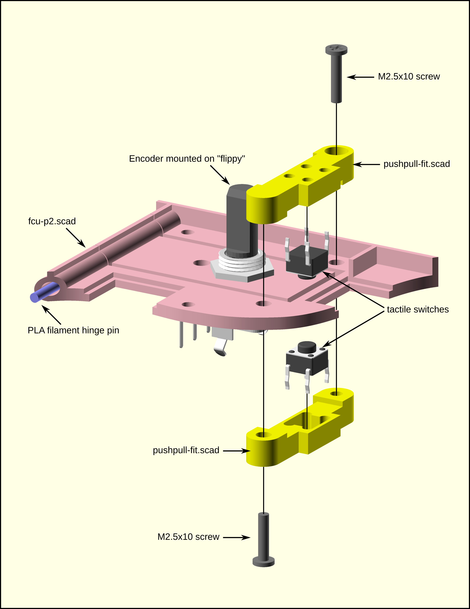

# FCU knobs push-pull implementation

Here a quick explanation of how we made the push-pull function for the FCU target knobs.

Each of the rotary encoders is mounted on floating hinge element of the base plate behind the FCU panel. These are referred to as "flippies" in the source code of [`fcu-p2.scad`](https://github.com/swapdisk/fpctl/blob/main/3d/fcu-p2.scad). For the hinge pin, we just used a piece 1.75 mm PLA filament. Sandwiched around each flippy are a pair of [`pushpull-fit.scad`](https://github.com/swapdisk/fpctl/blob/main/3d/pushpull-fit.scad) parts, one on top and one below. Each one holds a 6 mm tactile button switch in such a way to limit the movement of the encoder mounted to the flippy while activating either the top or bottom switch when the encoder knob is pushed and pulled.

The exploded view drawing and photo below should help you visualize how it's put together.

