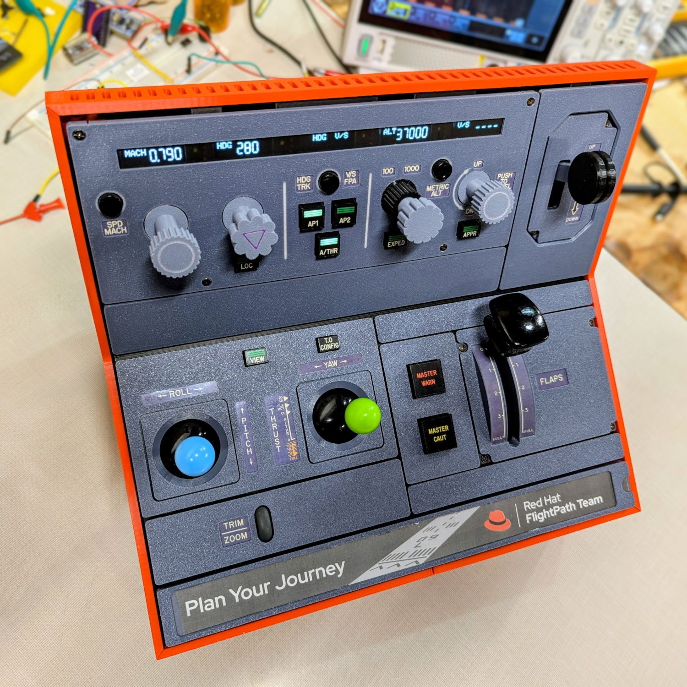

# fpctl: The FlightPath Controller

An ESP32-based physical cockpit designed to navigate the virtual skies of [FlightGear](https://www.flightgear.org/) and spark real-world conversations.

## About the Project

**fpctl** is a custom-built hardware flight deck interface designed specifically for the FlightPath Team at Red Hat.

Modeled largely after the Airbus A320 Flight Control Unit (FCU) and pedestal, this device serves as an interactive convention exhibit to show off on the expo floor and at happy hour receptions. Its primary purpose is to attract attention and serve as a unique conversation starter, demonstrating how physical hardware can integrate seamlessly with complex software systems, a tangible metaphor for the journeys we help our customers plan and execute.

It bridges the physical and digital worlds, allowing users to get hands-on with a flight simulator using realistic controls and displays, rather than just a keyboard and mouse.

## Features

The controller uses a hybrid approach to interface with the FlightGear simulator, combining low-latency USB HID inputs with bi-directional serial communication for complex data.

* The device appears to the host computer as both a standard USB HID Gamepad for sticks and buttons and a USB Serial device  for data exchange.
* The A320 FCU features dedicated rotary encoder knobs for speed/mach, heading/track, altitude, and vertical speed/FPA with each mechanically implementing push/pull functionality to manage autopilot modes.
* Five distinct OLED screens provide real-time feedback from the simulator, showing current flight parameters like target altitude, heading and speed synced via a custom serial protocol.
* The physical controls include analog joysticks for flight control, joystick view mode for panning and zooming the main simulator canvas, a dedicated flaps lever with detents, a landing gear switch, and various autopilot engagement buttons.
* Visual and audio feedback features include master warning and caution indicators and a built-in speaker for clicks and alert sounds providing immediate sensory feedback.

## How It's Built

At its heart, the controller is powered by an ESP32 microcontroller. To manage the extensive array of inputs and outputs with limited pins, the project employs several engineering tricks:

* Multiplexing is used to update the five SSD1306 OLED displays which share the same I2C address. A [PCA9548A I2C switch](https://www.nxp.com/docs/en/data-sheet/PCA9548A.pdf) is used to rapidly switch between them, allowing individual updates.
* Input multiplexing is achieved using resistor ladders, allowing the dozens of buttons to be read using only three analog input pins, significantly reducing the total GPIO count required.
* Five high-precision rotary encoders manage the autopilot knobs with push/pull capability physically implemented with a custom 3D-printed "floating hinge" mechanism.
* Analog inputs use potentiometers handle the joysticks and the flaps lever position.

## Software Architecture

The ESP32 firmware is written in C++ using the Arduino framework. The main loop runs at around 30K iterations per second on an [Espressif ESP32-S3-DevKitC](https://docs.espressif.com/projects/esp-dev-kits/en/latest/esp32s3/esp-dev-kits-en-master-esp32s3.pdf), acting as a highly efficient manager of several distinct subsystems:

* Reads analog sticks and resistor ladder buttons, sending standard USB HID Gamepad events to the host PC.
* High-frequency polling of rotary encoders ensures precise input tracking without missed clicks.
* Bi-Directional serial sync:
  * Input: The ESP32 parses a custom, pipe-separated (`|`) data stream arriving from FlightGear via serial. This data drives the OLED displays and LED indicators, ensuring the hardware always matches the simulation state.
  * Output: Functions like changing autopilot targets and controlling simulator view/zoom are sent to FlightGear as nasal script commands to be executed by the simulator.

## What's Here

This repo contains all the files used to make this project, but no effort has been taken to make this something anybody can recreate exactly. What I made was very much a prototype engineered piece by piece without any final design plan.

There is no bill of materials listing everything you need to order up on Digikey. Many of the components came out of my parts bins or were scrapped from other projects. So it's in that vein what's in this repo is offered. It's not a recipe to recreate exactly what I built, but rather a collection of code and ideas you can draw on to create your own thing.

* The OpenSCAD files for all the 3D printed parts are under the [`3d`](./3d/) directory. I built this one panel at a time using a building block approach. With better planning and more discipline, it could have probably been done with half as many parts. Apologies in advance for the cryptic comments and plethora of magic numbers. Use what you can as you see fit.

* The ESP32 firmware is in [`src/fpctl.ino`](./src/fpctl.ino). Unlike the messy 3D models mentioned above, this is nice clean C++ code and commented pretty well.

Interfaces and modifications to FlightGear are implemented by the following files which must be copied as explained below.

* [`fgfs/Protocol/fpctl.xml`](./fgfs/Protocol/fpctl.xml) defines the serial protocol that sends data from FlightGear to the controller. This file needs to be copied to the `$FG_ROOT/Protocol` directory on the host. See the comments at the top of the file for the example option that needs to be given on the `fgfs` command line or configured in your `.fgfsrc` file.
* [`fgfs/Input/Joysticks/js0.xml`](./fgfs/Input/Joysticks/js0.xml) defines the input bindings for the USB HID Gamepad axes and buttons send from the controller. This file needs to be copied to your `$HOME/.fgfs/Input/Joysticks/` directory.
* [`bin/naselx.sh`](./bin/nasalx.sh) is a simple shell script that reads nasal script commands sent from the controller and forwards them to be executed by FlightGear. This script needs to be run in the background and FlightGear needs to be run with the following options on the `fgfs` command line or configured in your `.fgfsrc` file: 
`--telnet=5401` 
`--allow-nasal-from-sockets`
* [`fgfs/Liveries/FP-fuselage.png`](./fgfs/Liveries/FP-fuselage.png) is a 4k fuselage image I made for the FlightPath team. Copy this over the fuselage image file of the A320-family plane you are flying (e.g., `DLH-fuselage.png`) to see this rendered in the simulator.

## Credits

* FIXME
